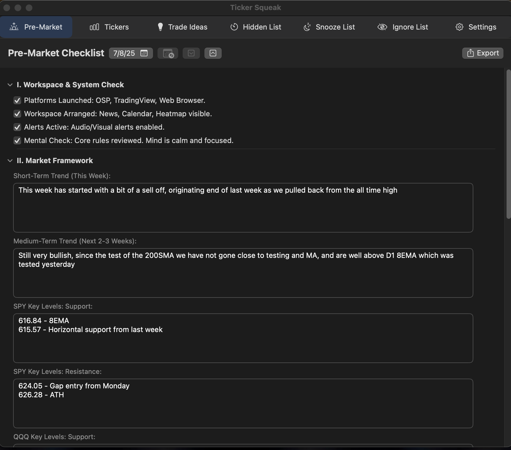
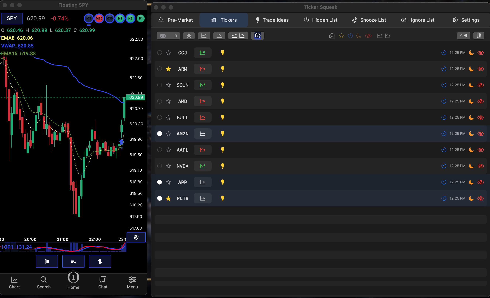
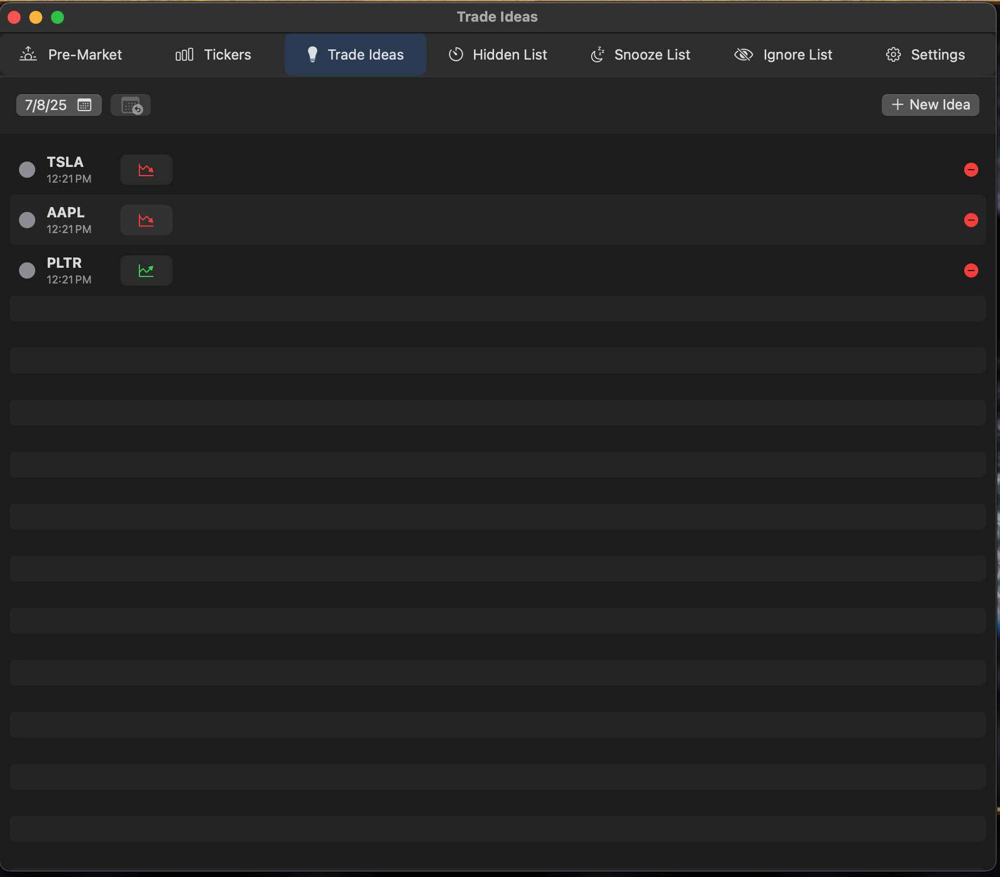
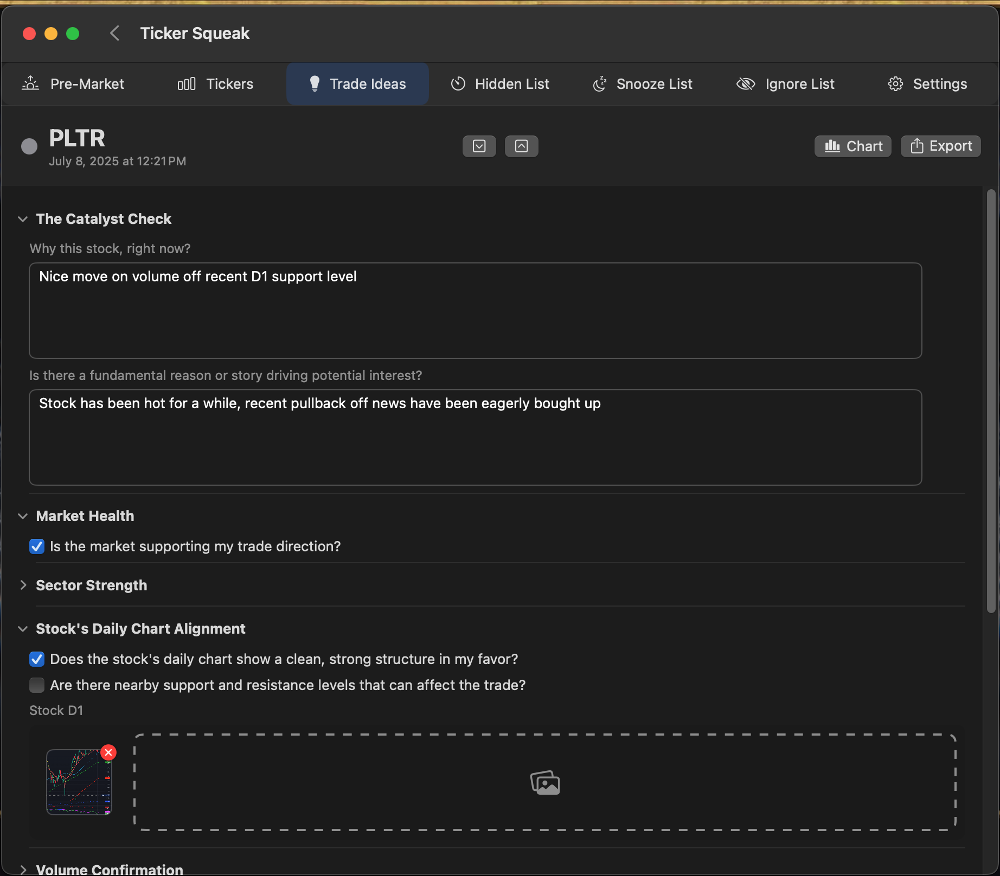
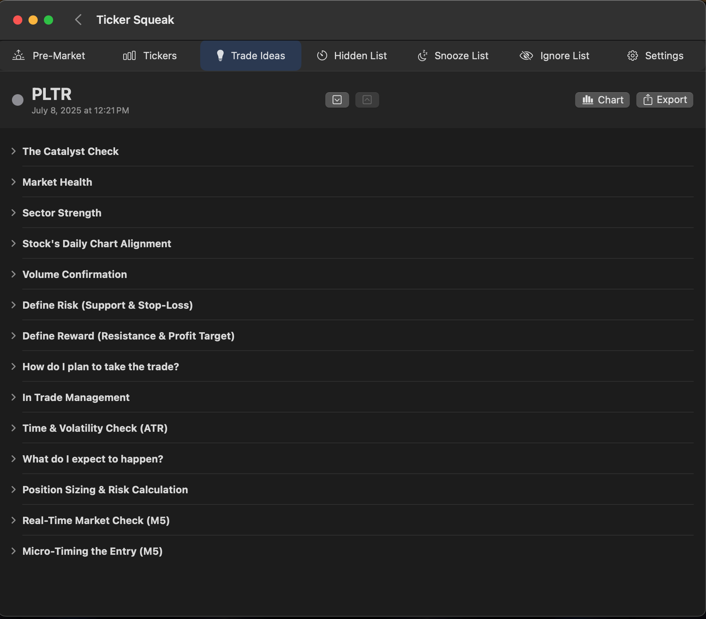

Ticker Squeak is a productivity tool for traders that captures stock ticker symbols mentioned in web-based chat rooms and organizes them in a native macOS application.

### How It Works

The system consists of two main components , and a bridging utilty:

1.  A **Browser Extension** (`TickerSqueakBrowserExtension`) that:
    * Monitors designated websites (e.g., OneOption chat, Discord).
    * Identifies stock ticker symbols from the page content in real-time.
    * Filters the tickers and sends them via an HTTP request to a locally running server on a specified port.

2.  A native **Swift macOS Client** (`TickerSqueak`) that:
    * Receives ticker notifications and displays them either within the app's interface or as native OS notifications with a user-selected sound alert.
    * Presents incoming tickers in an organized, inbox-style interface.
    * Allows for advanced ticker management and filtering:
        * **Star:** Mark important tickers for easy tracking.
        * **Ignore:** Permanently block specific tickers from appearing in the feed.
        * **Hide:** Temporarily hide a ticker for a defined short period.
        * **Snooze:** Hide a ticker for the remainder of the trading day.
    * Provides quick-launch integration to open a ticker's chart in **Option Stalker Pro** , **TradingView** , and **TC2000**.
    * Integrates trading strategy and preparation tools:
        * **Pre-Market Routine:** Provides a template to prepare for the trading day.
        * **Trade Idea Log:** Offers a template to systematically assess the viability of a potential trade.
        * **Local Storage & Export:** Data from both templates is stored locally for review within the app and can be exported as Markdown files.

3. The TC2000Bridge utility is a simple .net app that listens on the windows VM for calls and enables integration with TC2000 charting software.

### The Story

[How this came to be? The story behind Ticker Squeak](./the-story.md)

### User Manual

[Detailed user manual available](./manual.md)

#### Screenshots 📸

### Roadmap

* **Customizable Templates:** Allow users to create and edit their own templates for the pre-market routine and trade idea logs.
* **Cloud Sync:** Optional cloud integration to sync settings, ignored tickers, and trade logs across multiple devices.
* **Real-Time Mental State Monitoring:** Integration with the [Arctop SDK](https://github.com/arctop/iOS-SDK) to provide traders with insights into their focus and cognitive state during trading sessions.
* **AI-Powered Analysis Assistant:** An integrated AI assistant to provide on-demand analysis, sentiment scoring, or relevant news for captured tickers.

